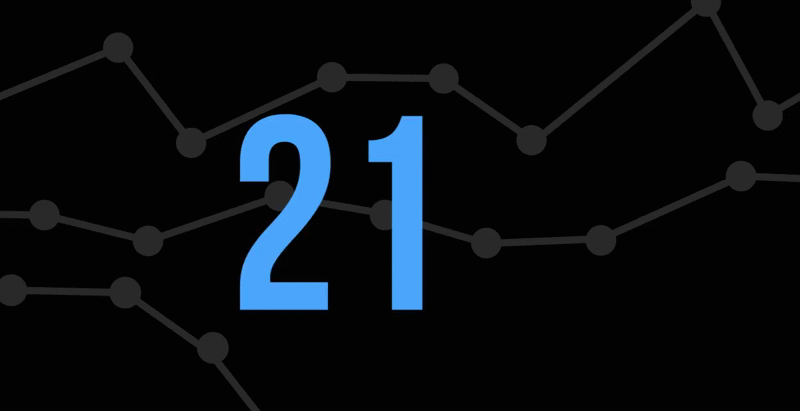

Heading1(Title)
<h1 align = center>Vyaapaar</h1>

&nbsp;

&nbsp;

&nbsp;

&nbsp;

&nbsp;

 

This is the repository for the project VyaaPaar, a web application built  by [Baracuda Viktara](#Developers).

<h2>📘 License </h2>

 Created under the MIT License. Refer to the <a href="https://github.com/git/git-scm.com/blob/main/MIT-LICENSE.txt">following</a> for more information.

<h2> :pencil: Contributors </h2>

<UL>
    <li><a href = "https://github.com/me-abhinav-1001"> Abhinav Anand </a> 
    <li><a href = "https://github.com/Spirit-ofJoy"> Yashendu Paresh Pandey </a>
    <li><a href = "https://github.com/ayayushsharma"> Ayush Sharma</a>
    <li><a href = "https://github.com/Ark2307"> Aryan Khandelwal</a>
    
</UL>
